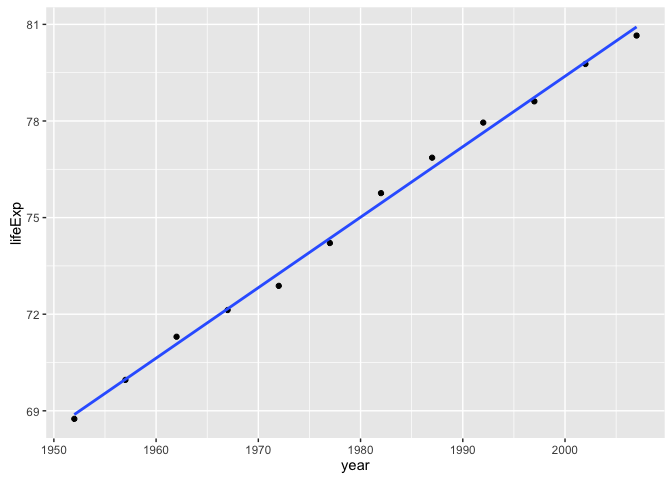
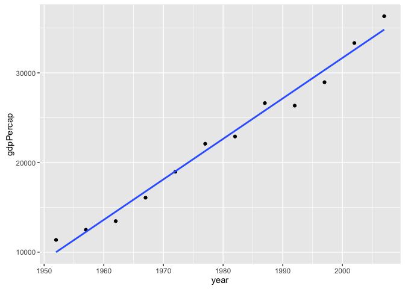

hw01\_gapminder
================
Matt Madsen
2016-09-19

``` r
library(ggplot2)
library(gapminder)
```

### Some Facts about the World

##### Tail of the data

``` r
tail(gapminder)
```

    ##       country continent year lifeExp      pop gdpPercap
    ## 1699 Zimbabwe    Africa 1982  60.363  7636524  788.8550
    ## 1700 Zimbabwe    Africa 1987  62.351  9216418  706.1573
    ## 1701 Zimbabwe    Africa 1992  60.377 10704340  693.4208
    ## 1702 Zimbabwe    Africa 1997  46.809 11404948  792.4500
    ## 1703 Zimbabwe    Africa 2002  39.989 11926563  672.0386
    ## 1704 Zimbabwe    Africa 2007  43.487 12311143  469.7093

##### Summary of the data

``` r
summary(gapminder)
```

    ##         country        continent        year         lifeExp     
    ##  Afghanistan:  12   Africa  :624   Min.   :1952   Min.   :23.60  
    ##  Albania    :  12   Americas:300   1st Qu.:1966   1st Qu.:48.20  
    ##  Algeria    :  12   Asia    :396   Median :1980   Median :60.71  
    ##  Angola     :  12   Europe  :360   Mean   :1980   Mean   :59.47  
    ##  Argentina  :  12   Oceania : 24   3rd Qu.:1993   3rd Qu.:70.85  
    ##  Australia  :  12                  Max.   :2007   Max.   :82.60  
    ##  (Other)    :1632                                                
    ##       pop              gdpPercap       
    ##  Min.   :6.001e+04   Min.   :   241.2  
    ##  1st Qu.:2.794e+06   1st Qu.:  1202.1  
    ##  Median :7.024e+06   Median :  3531.8  
    ##  Mean   :2.960e+07   Mean   :  7215.3  
    ##  3rd Qu.:1.959e+07   3rd Qu.:  9325.5  
    ##  Max.   :1.319e+09   Max.   :113523.1  
    ## 

##### Has Life Expectancy Increased?

``` r
plot(lifeExp ~ year, gapminder)
```


##### How is Wealth Divided?

``` r
hist(gapminder$gdpPercap)
```


How About Canada
----------------

Well it looks like we are living longer with the years....

``` r
p <- ggplot(subset(gapminder, country == 'Canada'), aes (x = year, y = lifeExp)) 

p + geom_point() + geom_smooth(lwd = 1, se = FALSE, method = "lm")
```



And getting wealthier...Hot Damn...

``` r
q <- ggplot(subset(gapminder, country == 'Canada'),  aes (x = year, y = gdpPercap))

q + geom_point() + geom_smooth(lwd = 1, se = FALSE, method = "lm")
```


