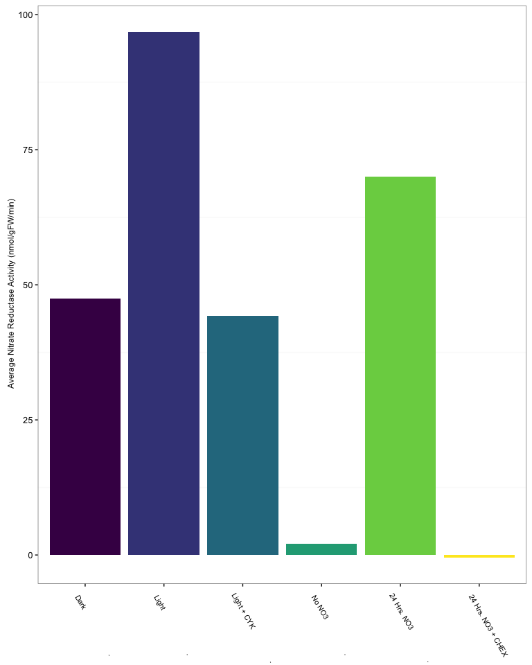

BIOL351\_lab5
================
Matt Madsen
October 22, 2016

``` r
library(tidyverse)
```

    ## Loading tidyverse: ggplot2
    ## Loading tidyverse: tibble
    ## Loading tidyverse: tidyr
    ## Loading tidyverse: readr
    ## Loading tidyverse: purrr
    ## Loading tidyverse: dplyr

    ## Conflicts with tidy packages ----------------------------------------------

    ## filter(): dplyr, stats
    ## lag():    dplyr, stats

``` r
library(ggplot2)
library(viridis)
library(knitr)
```

``` r
dat = read_csv("plants.csv")
```

    ## Parsed with column specification:
    ## cols(
    ##   treatment = col_character(),
    ##   group = col_character(),
    ##   `f_w-grams` = col_double(),
    ##   avg_abs = col_double(),
    ##   avg_nitrate = col_double(),
    ##   avg_nit_red = col_double()
    ## )

``` r
head(dat)
```

    ## # A tibble: 6 × 6
    ##     treatment   group `f_w-grams`   avg_abs avg_nitrate avg_nit_red
    ##         <chr>   <chr>       <dbl>     <dbl>       <dbl>       <dbl>
    ## 1        Dark   Light       0.123 0.3946667  2.84766667  47.4611111
    ## 2       Light   Light       0.096 0.7620000  5.80933333  96.8222222
    ## 3  Light_Cyto   Light       0.093 0.3706667  2.65433333  44.2388889
    ## 4      No_NO3 Protein       0.104 0.0570000  0.12566667   2.0944444
    ## 5      NO3_24 Protein       0.146 0.5563333  4.20466667  70.0777778
    ## 6 NO3_Chex_24 Protein       0.103 0.0380000 -0.02766667  -0.4611111

``` r
light <- dat %>% 
  select(treatment, avg_nit_red, group) %>% 
  filter(group =="Light")
```

``` r
colors1= viridis(6)

labels1 <- c("Dark                         .",              "Light                        .",              "Light + CYK                  .",              "No NO3                   .",              "24 Hrs. NO3                 .",              "24 Hrs. NO3 + CHEX")
p <- ggplot(dat, aes(treatment, avg_nit_red)) +
  geom_bar(stat = 'identity',  fill= colors1 )  

p <- p + labs(x = NULL,  y = " Average Nitrate Reductase Activity (nmol/gFW/min)")+
  theme_bw()+
  theme(axis.title.x =element_text(size=9, vjust = 0.9), axis.text.x=element_text(angle= 300, size=8, vjust = 0.75, hjust= 0.2), axis.title.y = element_text(size=9), panel.grid.major.x = element_blank(), panel.grid.major.y = element_blank())

p <- p + scale_x_discrete(labels = labels1)  

 

p
```

    ## Warning: Stacking not well defined when ymin != 0



``` r
ggsave("biol351_lab5_plot2.jpeg", width = 12, height=12, units = "cm")
```

    ## Warning: Stacking not well defined when ymin != 0

``` r
knitr::kable(dat)
```

| treatment     | group   |  f\_w-grams|   avg\_abs|  avg\_nitrate|  avg\_nit\_red|
|:--------------|:--------|-----------:|----------:|-------------:|--------------:|
| Dark          | Light   |       0.123|  0.3946667|     2.8476667|     47.4611111|
| Light         | Light   |       0.096|  0.7620000|     5.8093333|     96.8222222|
| Light\_Cyto   | Light   |       0.093|  0.3706667|     2.6543333|     44.2388889|
| No\_NO3       | Protein |       0.104|  0.0570000|     0.1256667|      2.0944444|
| NO3\_24       | Protein |       0.146|  0.5563333|     4.2046667|     70.0777778|
| NO3\_Chex\_24 | Protein |       0.103|  0.0380000|    -0.0276667|     -0.4611111|
